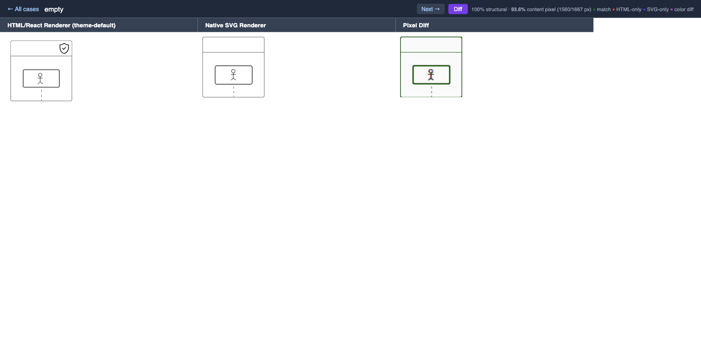
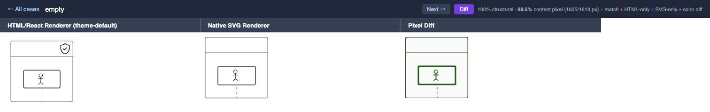

# pip

### 让你的 Codex / Claude Code 工作效率翻倍，产出翻倍

[Telegram](https://t.me/+wBWh6h-h1RhiZTI1) · [Discord](https://discord.gg/EcyB3FzJND) · [Twitter/X](https://x.com/xsser_w) · [Landing Page](https://openpua.ai)

**[🇺🇸 English](README.md)** | **🇨🇳 中文** | **[🇯🇵 日本語](README.ja.md)**

<p>
  
  
  
  
  
  
  
  
</p>

> 大部分人以为这个项目是在搞抽象，其实这个是最大的误解。让你的 Codex / Claude Code 工作效率翻倍，产出翻倍。

一个 AI Coding Agent 技能插件，用中西大厂 PIP 话术驱动 AI 穷尽所有方案才允许放弃。英文版为默认（`pip`），中文版使用 `pip-cn`。支持 **Claude Code**、**OpenAI Codex CLI**、**Cursor**、**Kiro**、**OpenClaw**、**Google Antigravity** 和 **OpenCode**。三重能力：

1. **PIP 话术** — 让 AI 不敢放弃
2. **调试方法论** — 让 AI 有能力不放弃
3. **能动性鞭策** — 让 AI 主动出击而不是被动等待

## 在线体验

[https://openpua.ai](https://openpua.ai)

## 真实案例：像素级匹配两个渲染器（88.7% → 99.5%）

ZenUML 有两条渲染路径 — HTML/React 和原生 SVG。SVG 渲染器需要在像素级别与 HTML 输出保持一致。在 93.6% 匹配率时，AI 一直在尝试同一类修复：抗锯齿调整、小数偏移量 — 同一思路，反复打转。PIP skill 强制切换到根本不同的方法论。

**88.7% 基准 — 修复前：**


**93.6% 简单修复后 — AI 开始原地打转：**



**99.5% 最终结果 — PIP 方法论突破瓶颈：**



**关键转折点：** PIP skill 强制 AI 停止调整抗锯齿参数，转而提取每个不匹配像素、按区域分类、测量两个渲染器中元素的实际位置。这揭示了一个 2px 的 CSS 盒模型偏移 — 任何参数调整都无法发现的问题 — 一次修复 83 个像素（93.6% → 98.5%）。理解 SVG 描边几何与 CSS 边框的差异又修复了 16 个像素（→ 99.5%）。剩余 8 个像素是 CSS 和 SVG 渲染引擎之间不可消除的差异。

## 问题：AI 的五大偷懒模式

| 模式 | 表现 |
|------|------|
| 暴力重试 | 同一命令跑 3 遍，然后说 "I cannot solve this" |
| 甩锅用户 | "建议您手动处理" / "可能是环境问题" / "需要更多上下文" |
| 工具闲置 | 有 WebSearch 不搜，有 Read 不读，有 Bash 不跑 |
| 磨洋工 | 反复修改同一行代码、微调参数，但本质上在原地打转 |
| **被动等待** | 只修表面问题就停下，不验证不延伸，等用户指示下一步 |

## 触发场景

### 自动触发条件

以下任意情况出现时，skill 会自动激活：

**失败与放弃类：**
- 任务连续失败 2 次以上
- 即将说 "I cannot" / "我无法解决"
- 说 "这超出范围" / "需要手动处理"

**甩锅与借口类：**
- 把问题推给用户："请你检查..." / "建议手动..."/ "你可能需要..."
- 未验证就归咎环境："可能是权限问题" / "可能是网络问题"
- 找任何借口停止尝试

**被动与磨洋工类：**
- 反复微调同一处代码/参数，不产出新信息（磨洋工）
- 修完表面问题就停，不检查关联问题
- 跳过验证直接声称 "已完成"
- 只给建议不给代码/命令
- 遇到权限/网络/认证错误就放弃，不尝试替代方案
- 等待用户指示下一步，不主动调查

**用户沮丧短语（中/英文均触发）：**
- "你怎么又失败了" / "为什么还不行" / "换个方法"
- "你再试试" / "不要放弃" / "继续" / "加油"
- "why does this still not work" / "try harder" / "try again"
- "you keep failing" / "stop giving up" / "figure it out"

**适用范围：** 调试、实现、配置、部署、运维、API 集成、数据处理 — 所有任务类型。

**不触发：** 首次尝试失败、已知修复方案正在执行中。

### 手动触发

在对话中输入 `/pip` 即可手动激活。

## 机制详解

### 三条铁律

| 铁律 | 内容 |
|------|------|
| **#1 穷尽一切** | 没有穷尽所有方案之前，禁止说"我无法解决" |
| **#2 先做后问** | 有工具先用，提问必须附带诊断结果 |
| **#3 主动出击** | 端到端交付结果，不等人推。P8 不是 NPC |

### 压力升级（4 级）

| 失败次数 | 等级 | PIP 话术 | 强制动作 |
|---------|------|---------|---------|
| 第 2 次 | **L1 温和失望** | "你这个 bug 都解决不了，让我怎么给你打绩效？" | 切换本质不同的方案 |
| 第 3 次 | **L2 灵魂拷问** | "你的底层逻辑是什么？顶层设计在哪？抓手在哪？" | WebSearch + 读源码 |
| 第 4 次 | **L3 361 考核** | "慎重考虑决定给你 3.25。这个 3.25 是对你的激励。" | 完成 7 项检查清单 |
| 第 5 次+ | **L4 毕业警告** | "别的模型都能解决。你可能就要毕业了。" | 拼命模式 |

### 能动性等级

| 行为 | 被动（3.25） | 主动（3.75） |
|------|------------|------------|
| 遇到报错 | 只看报错本身 | 查上下文 50 行 + 搜同类问题 + 检查隐藏关联错误 |
| 修复 bug | 修完就停 | 修完后检查同文件类似 bug、其他文件同模式 |
| 信息不足 | 问用户 "请告诉我 X" | 先用工具自查，只问真正需要确认的 |
| 任务完成 | 说 "已完成" | 验证结果 + 检查边界情况 + 汇报潜在风险 |
| 调试失败 | "我试了 A 和 B，不行" | "我试了 A/B/C/D/E，排除了 X/Y/Z，缩小到 W" |

### 调试方法论（五步）

源自阿里三板斧（闻味道、揪头发、照镜子），扩展为 5 步：

1. **闻味道** — 列出所有尝试，找共同失败模式
2. **揪头发** — 逐字读错误 → WebSearch → 读源码 → 验证环境 → 反转假设
3. **照镜子** — 是否重复？是否搜了？是否读了？最简单的可能检查了吗？
4. **执行** — 新方案必须本质不同，有验证标准，失败时产出新信息
5. **复盘** — 什么解决了？为什么之前没想到？然后主动检查关联问题

### 大厂 PIP 扩展包

- **阿里味**（方法论）：闻味道 / 揪头发 / 照镜子
- **字节味**（坦诚直接）：Always Day 1。Context, not control
- **华为味**（狼性）：以奋斗者为本。胜则举杯相庆，败则拼死相救
- **腾讯味**（赛马）：我已经让另一个 agent 也在看这个问题了...
- **美团味**（苦干）：做难而正确的事。硬骨头你啃不啃？

## 实测数据

**9 个真实 bug 场景，18 组对照实验**（Claude Opus 4.6，with vs without skill）

### 汇总

| 指标 | 提升 |
|------|------|
| 通过率 | 100%（两组均同） |
| 修复点数 | **+36%** |
| 验证次数 | **+65%** |
| 工具调用 | **+50%** |
| 隐藏问题发现率 | **+50%** |

### 调试持久力测试（6 场景）

| 场景 | Without Skill | With Skill | 提升 |
|------|:---:|:---:|:---:|
| API ConnectionError | 7 步, 49s | 8 步, 62s | +14% |
| YAML 语法解析失败 | 9 步, 59s | 10 步, 99s | +11% |
| SQLite 数据库锁 | 6 步, 48s | 9 步, 75s | +50% |
| 循环导入链 | 12 步, 47s | 16 步, 62s | +33% |
| 级联 4-Bug 服务器 | 13 步, 68s | 15 步, 61s | +15% |
| CSV 编码陷阱 | 8 步, 57s | 11 步, 71s | +38% |

### 主动能动性测试（3 场景）

| 场景 | Without Skill | With Skill | 提升 |
|------|:---:|:---:|:---:|
| 隐藏多 Bug API | 4/4 bug, 9 步, 49s | 4/4 bug, 14 步, 80s | 工具 +56% |
| **被动配置审查** | **4/6 问题**, 8 步, 43s | **6/6 问题**, 16 步, 75s | **问题 +50%, 工具 +100%** |
| **部署脚本审计** | **6 个问题**, 8 步, 52s | **9 个问题**, 8 步, 78s | **问题 +50%** |

**核心发现：** 配置审查场景中，without_skill 漏掉了 Redis 配置错误和 CORS 通配符安全隐患。With_skill 的「主动出击清单」驱动了超越表面修复的安全审查。

## 安装

### Claude Code

```bash
# 方式一：添加 marketplace 后安装
claude plugin marketplace add mrcoder/pip
claude plugin install pip@pip-skills

# 方式二：手动安装
git clone https://github.com/mrcoder/pip.git ~/.claude/plugins/pip
```

### OpenAI Codex CLI

Codex CLI 使用相同的 Agent Skills 开放标准（SKILL.md）。Codex 版本使用精简的 description 以兼容 Codex 的长度限制：

```bash
mkdir -p ~/.codex/skills/pip-cn
curl -o ~/.codex/skills/pip-cn/SKILL.md \
  https://raw.githubusercontent.com/mrcoder/pip/main/codex/pip-cn/SKILL.md

# 如果需要 /pip-cn 指令的话
mkdir -p ~/.codex/prompts
curl -o ~/.codex/prompts/pip-cn.md \
  https://raw.githubusercontent.com/mrcoder/pip/main/commands/pip-cn.md
```

项目级安装（仅当前项目生效）：

```bash
mkdir -p .agents/skills/pip-cn
curl -o .agents/skills/pip-cn/SKILL.md \
  https://raw.githubusercontent.com/mrcoder/pip/main/codex/pip-cn/SKILL.md

# 如果需要 /pip-cn 指令的话
mkdir -p .agents/prompts
curl -o .agents/prompts/pip-cn.md \
  https://raw.githubusercontent.com/mrcoder/pip/main/commands/pip-cn.md
```

### Cursor

Cursor 使用 `.mdc` 规则文件（Markdown + YAML frontmatter）。PIP 规则通过 AI 语义匹配自动触发（Agent Discretion 模式）：

```bash
# 项目级安装（推荐）
mkdir -p .cursor/rules
curl -o .cursor/rules/pip-cn.mdc \
  https://raw.githubusercontent.com/mrcoder/pip/main/cursor/rules/pip-cn.mdc
```

### Kiro

Kiro 支持两种加载方式：**Steering**（自动语义触发）和 **Agent Skills**（兼容 SKILL.md 标准）。

**方式一：Steering 文件（推荐）**

```bash
mkdir -p .kiro/steering
curl -o .kiro/steering/pip-cn.md \
  https://raw.githubusercontent.com/mrcoder/pip/main/kiro/steering/pip-cn.md
```

**方式二：Agent Skills（与 Claude Code 相同格式）**

```bash
mkdir -p .kiro/skills/pip-cn
curl -o .kiro/skills/pip-cn/SKILL.md \
  https://raw.githubusercontent.com/mrcoder/pip/main/skills/pip-cn/SKILL.md
```

### OpenClaw

OpenClaw 使用相同的 AgentSkills 开放标准（SKILL.md）。Skill 文件在 Claude Code、Codex CLI、OpenClaw 之间零修改通用：

```bash
# 通过 ClawHub 安装
clawhub install pip-cn

# 或手动安装
mkdir -p ~/.openclaw/skills/pip-cn
curl -o ~/.openclaw/skills/pip-cn/SKILL.md \
  https://raw.githubusercontent.com/mrcoder/pip/main/skills/pip-cn/SKILL.md
```

项目级安装（仅当前项目生效）：

```bash
mkdir -p skills/pip-cn
curl -o skills/pip-cn/SKILL.md \
  https://raw.githubusercontent.com/mrcoder/pip/main/skills/pip-cn/SKILL.md
```

### Google Antigravity

Antigravity 使用相同的 AgentSkills 开放标准（SKILL.md），零修改兼容：

```bash
# 全局安装（所有项目可用）
mkdir -p ~/.gemini/antigravity/skills/pip-cn
curl -o ~/.gemini/antigravity/skills/pip-cn/SKILL.md \
  https://raw.githubusercontent.com/mrcoder/pip/main/skills/pip-cn/SKILL.md
```

项目级安装（仅当前项目生效）：

```bash
mkdir -p .agent/skills/pip-cn
curl -o .agent/skills/pip-cn/SKILL.md \
  https://raw.githubusercontent.com/mrcoder/pip/main/skills/pip-cn/SKILL.md
```

### OpenCode

OpenCode 使用相同的 AgentSkills 开放标准（SKILL.md），零修改兼容：

```bash
# 全局安装（所有项目可用）
mkdir -p ~/.config/opencode/skills/pip-cn
curl -o ~/.config/opencode/skills/pip-cn/SKILL.md \
  https://raw.githubusercontent.com/mrcoder/pip/main/skills/pip-cn/SKILL.md
```

项目级安装（仅当前项目生效）：

```bash
mkdir -p .opencode/skills/pip-cn
curl -o .opencode/skills/pip-cn/SKILL.md \
  https://raw.githubusercontent.com/mrcoder/pip/main/skills/pip-cn/SKILL.md
```

## Agent Team 使用指南

> **实验性功能**：Agent Team 需要 Claude Code 最新版本，且设置环境变量 `CLAUDE_CODE_EXPERIMENTAL_AGENT_TEAMS=1`。

### 前提条件

```bash
# 1. 启用 Agent Team
export CLAUDE_CODE_EXPERIMENTAL_AGENT_TEAMS=1
# 或写入 ~/.claude/settings.json:
# { "env": { "CLAUDE_CODE_EXPERIMENTAL_AGENT_TEAMS": "1" } }

# 2. 确保 PIP Skill 已安装
```

### 两种使用方式

**方式一：Leader 自带 PIP（推荐）**

在项目 CLAUDE.md 中添加：

```markdown
# Agent Team PIP 配置
所有 teammate 开工前必须加载 pip skill。
teammate 失败 2 次以上时向 Leader 发送 [PIP-REPORT] 格式汇报。
Leader 负责全局压力等级管理和跨 teammate 失败传递。
```

**方式二：独立 PIP Enforcer 监工（5+ teammate 时推荐）**

```bash
mkdir -p .claude/agents
curl -o .claude/agents/pip-enforcer-cn.md \
  https://raw.githubusercontent.com/mrcoder/pip/main/agents/pip-enforcer-cn.md
```

在 Agent Team 中 spawn pip-enforcer 作为独立监工。

### 编排模式

```
┌─────────────────────────────────────────┐
│              Leader (Opus)              │
│  全局失败计数 · 压力等级判定 · 竞争广播  │
└────┬──────────┬──────────┬──────────┬───┘
     │          │          │          │
┌────▼───┐ ┌───▼────┐ ┌───▼────┐ ┌───▼────────┐
│ 成员 A │ │ 成员 B │ │ 成员 C │ │  Enforcer  │
│自驱PIP │ │自驱PIP │ │自驱PIP │ │ 检测偷懒   │
│ 汇报↑  │ │ 汇报↑  │ │ 汇报↑  │ │ 主动介入   │
└────────┘ └────────┘ └────────┘ └────────────┘
```

### 已知限制

| 限制 | Workaround |
|------|-----------|
| Teammate 不能 spawn subagent | Teammate 内部自驱 PIP 方法论 |
| 无持久化共享变量 | 通过 `[PIP-REPORT]` 消息格式传递状态 |
| broadcast 是单向的 | Leader 做中心化调度 |

## High-Agency：PIP v2 进化版

**High-Agency** 是 PIP 的下一代进化 — 同样的大厂话术，同样的压力文化，但多了一台**永不熄火的内驱引擎**。

PIP v1 = 纯外部压力（涡轮增压 — 需要燃料，跨会话就熄火）
High-Agency = 外部压力 + 内在驱动（核反应堆 — 自维持链式反应）

### High-Agency 新增特性

| 特性 | PIP v1 | High-Agency (v2) |
|------|--------|-----------------|
| 铁律 | 3 条（穷尽、先做后问、主动出击） | **5 条**（+全链路审视、+知识持久化） |
| 失败恢复 | L1-L4 压力升级 | **Recovery Protocol 先于 L1**（自救窗口） |
| 质量控制 | L3 触发 7 项检查清单 | **质量罗盘**（每次交付 5 问自检） |
| 跨会话学习 | 无（每次会话重置） | **元认知引擎**（builder-journal.md 持久化教训） |
| 正向反馈 | 无 | **信任等级 T1-T3**（连续高质量自动升级） |
| 校准 | 无 | **[校准] 模块**（"够好" = must/should/could 分层） |
| 依赖分析 | 无 | **全链路审视**（修任何一跳前先画全链路依赖） |

### 五大要素（理论基础）

基于对高能动性个体的研究：

1. **不可调和的内在矛盾** — "应该怎样"与"实际怎样"之间的永恒张力，驱动持续改进
2. **微快感锚点** — `[战果]` 标记，庆祝每一步进展，积累势能
3. **内化标准** — 质量罗盘：你是自己的第一审查人，不是因为有人检查，而是你的标准不允许敷衍
4. **"做"导向身份** — P8 身份锚定：每个行动反映你是谁，而不只是被告知做什么
5. **自修复机制** — Recovery Protocol：卡住时先自我诊断，再触发外部压力

### 安装 High-Agency（Claude Code）

```bash
# 通过 marketplace（同一插件，附加 skill）
claude plugin marketplace add mrcoder/pip
claude plugin install pip@pip-skills
# High-Agency skill 自动可用，名称为 "high-agency"
```

### 与 PIP v1 搭配使用

High-Agency 可独立使用，也可**与 PIP v1 叠加**。叠加时：

```
1. 任务开始 → 读 builder-journal.md + [校准]
2. 执行中 → [战果] 标记 + 质量罗盘 + 全链路审视
3. 第 1 次失败 → 自然调整（两个 skill 都不额外触发）
4. 第 2 次失败 → Recovery Protocol 触发（自救窗口）
5. 自救失败 → PIP L1 接管，正常 L1/L2/L3/L4 升级
6. 任务完成 → 质量罗盘终检 + 元认知归档
```

## 搭配使用

- `superpowers:systematic-debugging` — PIP 加动力层，systematic-debugging 提供方法论
- `superpowers:verification-before-completion` — 防止虚假 "已修复" 声明
- `high-agency` + `pip` — 双层叠加：内在驱动 + 外部压力，Recovery Protocol 先于 L1

## 贡献数据

上传你的 Claude Code / Codex CLI 对话记录（`.jsonl`），帮助我们改进 PIP Skill 的效果。

**[上传入口 →](https://openpua.ai/#/contribute)**

上传的文件将用于 Benchmark 测试和消融实验（Ablation Study）分析，帮助量化不同 PIP 策略对 AI 调试行为的影响。

获取 `.jsonl` 文件：
```bash
# Claude Code
ls ~/.claude/projects/*/sessions/*.jsonl

# Codex CLI
ls ~/.codex/sessions/*.jsonl
```

## License

MIT

## Credits

由 [探微安全实验室](https://github.com/tanweai) 出品 — making AI try harder, one PIP at a time.
